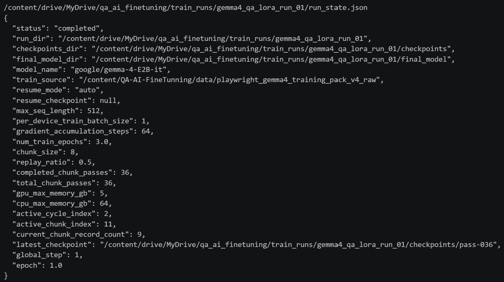
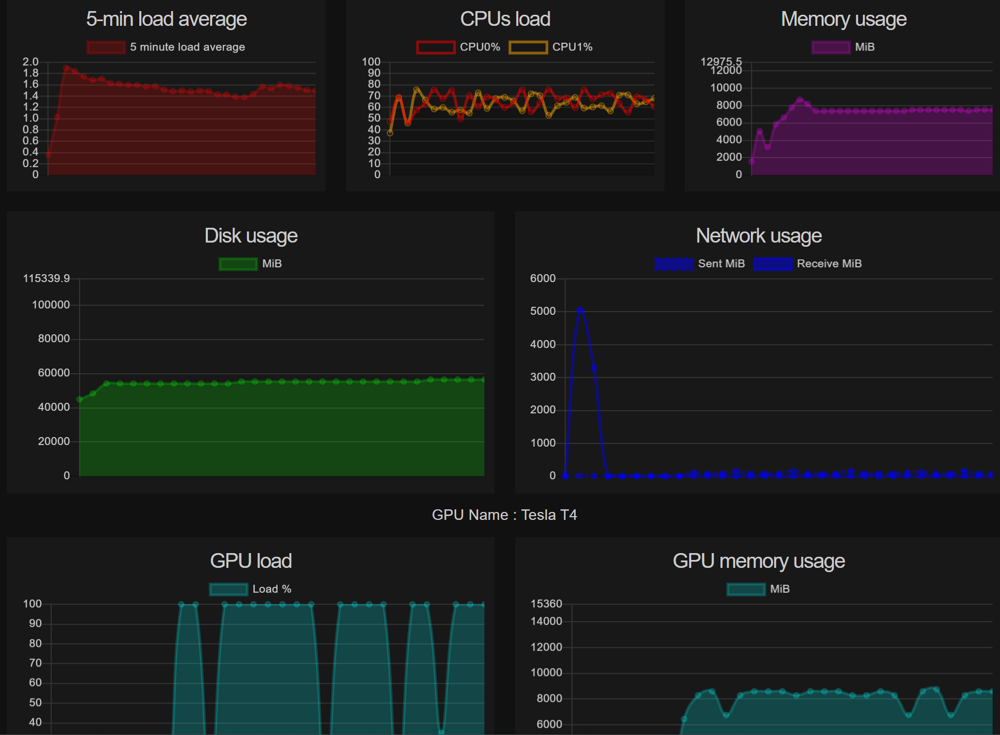

# QA-AI-FineTunning

Gemma 4 기반으로 QA 테스트 시나리오를 생성하기 위한 Colab 우선 파인튜닝 프로젝트입니다.  
목표는 다음 두 단계를 안정적으로 수행하는 것입니다.

1. 학습 데이터로 `google/gemma-4-E2B-it`를 LoRA 방식으로 파인튜닝
2. 학습된 어댑터를 이용해 입력 자료에서 Playwright 실행용 JSON과 시나리오 설명을 생성

현재 레포는 **Colab T4 환경에서 실제 학습 완료까지 확인한 상태**를 기준으로 정리되어 있습니다.

## 프로젝트 목적

이 프로젝트는 웹/앱 분석 산출물에서 QA 테스트 시나리오를 자동 생성하는 모델을 만드는 것을 목표로 합니다.

- 학습 입력: QA 시나리오 생성용 학습 데이터
- 학습 출력: Gemma 4 LoRA 어댑터
- 추론 입력: 페이지 분석 결과물 묶음
- 추론 출력:
  - Playwright에서 바로 활용 가능한 JSON
  - 사람이 읽을 수 있는 시나리오 설명

## 현재 기준으로 완료된 내용

- `google/gemma-4-E2B-it` 기반 학습 파이프라인 구성 완료
- Colab T4 대응용 저메모리 학습 설정 적용 완료
- 체크포인트, 로그, 재시작 상태 파일 저장 구조 완료
- 학습 데이터는 레포 내부 디렉토리 기준으로 바로 읽도록 구성 완료
- 테스트 입력도 레포 내부 디렉토리 기준으로 바로 읽도록 구성 완료
- 추론은 메모리 부담을 줄이기 위해 **페이지별 분할 생성** 방식 적용 완료

## 실제 학습 완료 결과

Colab에서 학습이 완료되면 아래와 같은 상태 파일이 생성됩니다.

- `run_state.json`
- `checkpoints/`
- `final_model/`
- `logs/train.log`

실제 완료 예시:



위 결과에서 확인할 수 있는 핵심 값:

- `status: completed`
- `model_name: google/gemma-4-E2B-it`
- `max_seq_length: 512`
- `per_device_train_batch_size: 1`
- `gradient_accumulation_steps: 64`
- `chunk_size: 8`
- `replay_ratio: 0.5`
- `completed_chunk_passes: 36`
- `gpu_max_memory_gb: 5`
- `cpu_max_memory_gb: 64`

즉, 현재 학습 파이프라인은 **T4 1장 환경에 맞춰 매우 보수적인 설정으로 끝까지 도는 구조**입니다.

## Colab 모니터링 예시

학습 중 Colab Monitor로 확인한 실제 예시 화면입니다.



확인 포인트:

- GPU: `Tesla T4`
- GPU 메모리 사용량: 대략 8~9GiB 수준
- CPU / RAM / Disk / Network 상태를 함께 확인 가능

## 권장 실행 환경

### 학습

- Colab GPU: `T4`
- 런타임: Python 3
- 저장소: Google Drive

### 추론

- Colab 또는 별도 Python 서버
- GPU 16GB 단일 장비에서도 추론 전용으로는 가능성이 높음
- 단, 입력을 한 번에 다 넣지 않고 페이지별로 분할 처리하는 현재 방식 유지 권장

## 디렉토리 구조

핵심 파일은 아래와 같습니다.

- [colab/01_train_gemma_qa.ipynb](colab/01_train_gemma_qa.ipynb)
  - 학습용 Colab 노트북
- [colab/02_test_gemma_qa.ipynb](colab/02_test_gemma_qa.ipynb)
  - 추론용 Colab 노트북
- [src/qafinetune/train.py](src/qafinetune/train.py)
  - 학습 엔트리포인트
- [src/qafinetune/infer.py](src/qafinetune/infer.py)
  - 추론 엔트리포인트
- [src/qafinetune/io_utils.py](src/qafinetune/io_utils.py)
  - 데이터 로딩, 프롬프트 생성, 입출력 유틸리티
- [data/playwright_gemma4_training_pack_v4_raw](data/playwright_gemma4_training_pack_v4_raw)
  - 학습용 데이터 디렉토리
- [data/test_inputs/2026-04-17T09-38-00-6751880b](data/test_inputs/2026-04-17T09-38-00-6751880b)
  - 테스트용 입력 디렉토리

## VS Code + Colab 사용 흐름

이 레포는 VS Code에서 Colab 확장을 통해 실행하는 흐름도 고려해서 구성했습니다.

권장 흐름:

1. VS Code에서 이 레포를 엽니다.
2. `colab/01_train_gemma_qa.ipynb` 또는 `colab/02_test_gemma_qa.ipynb`를 엽니다.
3. `Select Kernel`에서 `Colab -> Auto Connect`를 선택합니다.
4. 필요하면 `Upload to Colab`을 사용하거나, 현재처럼 GitHub 최신 코드를 Colab에서 clone 하도록 둡니다.
5. 노트북 셀을 순서대로 실행합니다.

## 1단계: 학습

학습 노트북은 [colab/01_train_gemma_qa.ipynb](colab/01_train_gemma_qa.ipynb) 입니다.

### 현재 학습 방식

현재 학습은 full fine-tuning이 아니라 **4bit QLoRA 계열의 저메모리 LoRA 학습**입니다.

적용된 핵심:

- `bitsandbytes` 4bit 로딩
- LoRA 어댑터 학습
- gradient checkpointing
- CPU offload
- chunked training
- replay 기반 순차 학습
- Drive 체크포인트 저장
- 자동 resume

### T4 대응 기본 학습 설정

T4 기준 권장 프리셋:

- `per_device_train_batch_size = 1`
- `gradient_accumulation_steps = 64`
- `max_seq_length = 512`
- `lora_rank = 4`
- `lora_alpha = 8`
- `GPU_MAX_MEMORY_GB = 5`
- `CPU_MAX_MEMORY_GB = 64`
- `CHUNK_SIZE = 8`
- `REPLAY_RATIO = 0.5`

### 왜 chunked training을 쓰는가

`Gemma 4 E2B`는 T4에서 메모리가 넉넉하지 않습니다.  
그래서 전체 데이터를 한 번에 학습하지 않고, 다음 방식으로 나누어 학습합니다.

- 데이터를 작은 chunk로 분할
- chunk별로 순차 학습
- 이전 chunk 일부를 replay
- 중간 pass마다 adapter 저장

이 구조 덕분에 T4에서도 끝까지 학습을 완료할 수 있었습니다.

### 학습 실행 순서

1. `01_train_gemma_qa.ipynb` 실행
2. 1번 셀: 레포 준비
3. 2번 셀: 의존성 설치
4. 3번 셀: Google Drive 마운트
5. 5번 셀: 학습 파라미터 확인
6. 6번 셀: GPU 환경 점검
7. 8번 셀: 로컬 학습 디렉토리 확인
8. 9번 셀: 학습 실행
9. 10번 셀: `run_state.json` 확인

### 학습 결과 저장 위치

기본 저장 경로:

```text
/content/drive/MyDrive/qa_ai_finetuning/train_runs/gemma4_qa_lora_run_01
```

주요 결과물:

- `checkpoints/`
- `final_model/`
- `logs/`
- `run_state.json`

### resume 동작

Colab 세션이 끊기더라도 `RESUME_MODE = "auto"`로 두면 이어서 실행할 수 있게 구성했습니다.

기록되는 대표 파일:

- `runtime_profile.json`
- `dataset_profile.json`
- `run_state.json`
- `logs/train.log`
- `checkpoints/pass-*`
- `final_model/`

## 2단계: 테스트 / 추론

추론 노트북은 [colab/02_test_gemma_qa.ipynb](colab/02_test_gemma_qa.ipynb) 입니다.

### 현재 추론 방식

추론은 처음에는 전체 입력 번들을 한 번에 넣었지만, T4에서 커널이 죽는 문제가 있었습니다.  
그래서 현재는 **페이지별 분할 생성 방식**으로 바꿨습니다.

현재 방식:

- 루트 공통 정보:
  - `final-report.json`
  - `graph-snapshot.json`
  - `crawl-graph.json`
- 각 페이지 디렉토리:
  - 중요한 JSON만 선별
- 페이지별로 순차 생성
- 최종적으로 통합 JSON / 통합 설명 저장

### 추론 기본값

현재 Colab T4 기준 권장값:

- `MAX_NEW_TOKENS = 700`
- `MAX_INPUT_TOKENS = 1536`
- `TEMPERATURE = 0.0`
- `TOP_P = 1.0`

더 보수적으로 가고 싶으면 아래처럼 줄일 수 있습니다.

- `MAX_NEW_TOKENS = 300`
- `MAX_INPUT_TOKENS = 1024`

### 추론 실행 순서

1. `02_test_gemma_qa.ipynb` 실행
2. 1번 셀: 레포 준비
3. 2번 셀: 의존성 설치
4. 3번 셀: Google Drive 마운트
5. 4번 셀: 어댑터 경로 및 생성 파라미터 확인
6. 6번 셀: 입력 소스 확인
7. 7번 셀: 생성 실행
8. 8번 셀: 결과 미리보기

### 테스트 입력

현재 기본 테스트 입력 디렉토리:

```text
/content/QA-AI-FineTunning/data/test_inputs/2026-04-17T09-38-00-6751880b
```

### 학습 결과 어댑터 경로

기본 어댑터 경로:

```text
/content/drive/MyDrive/qa_ai_finetuning/train_runs/gemma4_qa_lora_run_01/final_model
```

### 추론 결과 저장 위치

기본 저장 경로:

```text
/content/drive/MyDrive/qa_ai_finetuning/generated_runs/gemma4_qa_generation_01
```

생성 결과:

- `playwright_scenario.json`
- `scenario_summary.md`
- `pages/<page_name>/playwright_scenario.json`
- `pages/<page_name>/scenario_summary.md`
- `raw_model_output.txt`

## 데이터 포맷 지원

학습/추론 입력에서 지원하는 파일 형식:

- `.json`
- `.jsonl`
- `.csv`
- `.parquet`
- `.txt`
- `.md`

학습 시에는 `train_raw.jsonl`가 있으면 우선 사용합니다.

## 이 프로젝트에서 실제로 해결한 문제들

진행 중 아래 이슈들을 실제로 겪었고, 현재 코드에 반영되어 있습니다.

- Colab에서 `qafinetune` import 실패
- `transformers` 버전 문제로 `gemma4` 인식 실패
- `processor.tokenizer` 가정으로 인한 Gemma 4 호환성 문제
- T4에서 Gemma 4 로딩 시 OOM
- `TrainingArguments` / `Trainer`의 최신 버전 호환성 문제
- 추론 시 전체 입력 번들로 인한 커널 종료
- 업로드 위젯 세션 문제

현재 코드는 이런 문제를 우회하거나 완화하도록 수정되어 있습니다.

## 주의 사항

### 1. 학습은 느리지만 끝까지 가는 쪽으로 설계됨

현재 구조는 “빠른 학습”보다 “T4에서 살아남는 학습”에 초점을 맞췄습니다.  
따라서 속도는 느릴 수 있습니다.

### 2. 추론도 한 번에 큰 입력을 넣지 않는 것이 중요함

Gemma 4 E2B + 16GB 전후 GPU 환경에서는 입력과 생성 길이를 너무 크게 주면 커널이 죽을 수 있습니다.

### 3. Colab Monitor는 선택 기능

학습 노트북에는 Smankusors Colab Monitor 셀이 들어있습니다.  
기본값은 비활성화이며, 외부 스크립트를 `exec()` 하는 방식이라 선택적으로만 사용하는 것을 권장합니다.

## 배포 관점 정리

현재 구조를 기준으로 보면:

- **학습**: T4급 환경에서는 매우 빡빡함
- **추론**: 16GB GPU 1장 환경이라면 충분히 현실적

배포 서버에서는 다음 방식을 권장합니다.

- 모델은 서버 시작 시 1회 로드
- 요청마다 새로 로드하지 않기
- 입력은 페이지별 분할 처리
- 요청 동시성은 큐 기반으로 제한
- 긴 작업은 백그라운드 job 방식으로 처리

## 빠른 시작

### 학습

```text
colab/01_train_gemma_qa.ipynb 실행
```

### 추론

```text
colab/02_test_gemma_qa.ipynb 실행
```

### 현재 기본 모델

```text
google/gemma-4-E2B-it
```

### 현재 기본 학습 결과 경로

```text
/content/drive/MyDrive/qa_ai_finetuning/train_runs/gemma4_qa_lora_run_01/final_model
```

---

필요하면 다음 단계로는 아래를 이어서 정리하면 됩니다.

- Python 서버 배포용 추론 API 정리
- FastAPI/Flask 구조화
- 결과 JSON 스키마 고정
- 페이지별 결과를 하나의 최종 시나리오로 병합하는 후처리 개선
